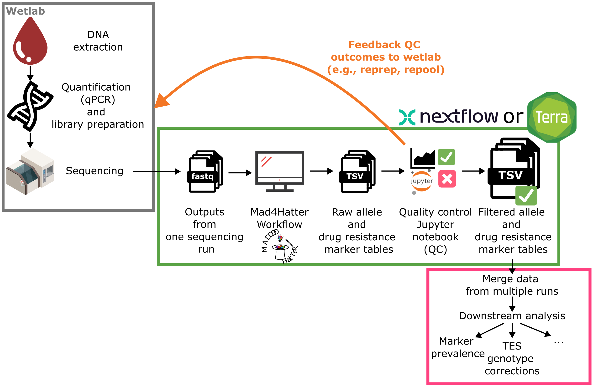

# Getting Started with Analysing mad4hatter Pipeline Outputs

**Release Date:** 29/07/2026

This guide provides a brief overview of the key steps to help you move from raw pipeline outputs to meaningful downstream analyses.

## Make sure the pipeline version is up to date 

At the time of writing, the most recently released version of the pipeline is **v1.0.0**. This version introduces updates to the column names and output formats, along with other changes. Changes are documented [here](v100-release.md) and information about the outputs can be found [here](https://eppicenter.github.io/wonderland-docs/pipeline-outputs/). If you’re starting fresh, this is the version you should use, as it’s the one maintained for compatibility with downstream tools. 

If you’re working with outputs from older versions (v0.1.8 or later), differences in parameters are unlikely to dramatically change results, but some processing steps have been refined. Keep in mind that all processing is performed on a **per-run basis**, so consistency across runs matters later.

If you already have outputs generated with older versions of the pipeline, there are scripts available to convert them into the new standardized format in the [mad4hatter-tools repository](https://github.com/EPPIcenter/mad4hatter-tools).

## Quality Control (QC) and Filtering 

Once you have mad4hatter pipeline outputs for a sequencing run, the next critical step is **quality control (QC)**.

At a minimum, you should:
* Check that control samples behave as expected
* Apply filtering thresholds (recommended minimum: **WSAF ≥ 1%**)
See the [QC page](../qc.md) for more information. 

## Merging Data from Across Runs

After QC, you’ll typically want to **combine datasets from multiple runs**.
At this stage:
* You are effectively aggregating per-run outputs into a larger dataset
* You can filter or merge samples that had insufficient coverage 
* Standardization becomes increasingly important
* Metadata integration (if available) adds substantial value

A more formal approach involves structuring your allele data into [**PMO (Portable Microhaplotype Object)**](https://plasmogenepi.github.io/PMO_Docs/) format, which enables better interoperability and reproducibility [(Hathaway & Murie et al. 2025)](https://doi.org/10.64898/2025.12.10.693568). While not strictly required to proceed, it’s worth considering as your datasets grow.

## Downstream analyses

With cleaned and merged allele tables, you’re ready to explore biological questions. A range of tools and workflows are available, many cataloged on [PGEforge](https://mrc-ide.github.io/PGEforge/), a community-driven platform for genomic epidemiology tools.

Below are some common analysis directions.

### Drug resistance marker prevalence

You can estimate:
* **Prevalence**: proportion of infections carrying resistance markers in a given population
* **Frequency**: proportion of parasites carrying resistance markers in a given population

You *can* calculate these metrics directly from the drug resistance outputs produced by the mad4hatter pipeline. While estimating **prevalence** of single-locus markers is relatively straightforward, deriving **frequencies** or estimates for **multi-locus markers** is more involved and typically requires specialized tools or more complex code (see resources on [PGEcore](https://github.com/PlasmoGenEpi/PGEcore) and [PGEforge](https://mrc-ide.github.io/PGEforge/)).

To simplify this process, the [*plasmodiumdrugres* Nextflow pipeline](https://github.com/PlasmoGenEpi/plasmodiumdrugres) is available that takes allele tables as input and generates these summary statistics using established methods. It also supports running multiple populations in parallel (e.g., to compare results across different provinces). Overall, this provides a more reproducible and scalable workflow for surveillance and reporting.

### Within-host genetic diversity

For assessing diversity within infections, tools like **moire** are commonly used. See the [PGEforge pages on moire](https://mrc-ide.github.io/PGEforge/tutorials/moire/moire_background.html) for more information.

Key considerations:
* Use **high-quality, filtered data** (post-QC)
* Restrict analysis to targets in the **diversity module (e.g., primer pool D1.1)**
* Among moire outputs, **eCOI (effective complexity of infection)** is generally the most robust metric.

As a sanity check, compare moire outputs to simpler naive estimates, such as:
* The **98th percentile of allele counts per target per sample**

[PGEcore](https://github.com/PlasmoGenEpi/PGEcore/tree/main/scripts) includes wrapper scripts to make running these tools (MOIRE and naive methods) easier. These scripts are constantly being improved. If you have any suggestions or a script that you would like to add, please reach out by [logging an issue](https://github.com/PlasmoGenEpi/PGEcore/issues/new).

### Between-sample relatedness

To study genetic relatedness between samples, tools like **dcifer** can be used. [PGEforge also provides documentation and resources](https://mrc-ide.github.io/PGEforge/tutorials/dcifer/dcifer_background.html) to get started.

### Non-falciparum species detection

While most tools focus on *Plasmodium falciparum*, the panel also captures **non-falciparum species**. ßYou can identify these LDH targets by looking for the names not starting with “Pf”. 
A commonly used heuristic:
* Require >100 total reads across ldh targets
* Require each species to contribute >1% of those reads

Further classification (e.g., distinguishing *P. ovale curtisi* vs *wallikeri*) can be done by blasting ASVs or inspecting sequence differences using the pseudocigars.

## Final thoughts

Working with mad4hatter outputs involves a series of structured steps:

1. Use standardized, up-to-date outputs
2. Perform rigorous QC and filtering
3. Merge datasets thoughtfully
4. Choose appropriate downstream tools

Each step builds on the previous one, and skipping or rushing early stages can compromise your results.

As the ecosystem continues to grow, resources like [PGEforge](https://mrc-ide.github.io/PGEforge/), [PGEcore](https://github.com/PlasmoGenEpi/PGEcore/), and analysis pipelines like [*plasmodiumdrugres*](https://github.com/PlasmoGenEpi/plasmodiumdrugres) are making these analyses more accessible and reproducible.

If you’re just getting started, expect some iteration. Ask questions, compare methods, and validate your results.
